# Agent Module

Agentic RAG for PDF manuals using LangGraph, Qdrant, and Brave Search.

---

## Overview

The `manuals_agent` module implements an autonomous agent that:

1. **Queries local manuals first** (always, no exceptions)
2. **Falls back to web search** if needed
3. **Generates cited, grounded answers**
4. **Handles multi-step reasoning**

Powered by LangGraph and OpenAI GPT-4o-mini.

---

## Command-Line Interface

```bash
uv run python -m synth_rag.manuals_agent [OPTIONS]
```

### Options

| Option | Type | Default | Description |
|--------|------|---------|-------------|
| `--question` | str | *required* | Question to ask |
| `--collection` | str | `midi_manuals` | Qdrant collection name |
| `--model` | str | `gpt-4o-mini` | OpenAI model name |
| `--device` | choice | `mps` | Device for ColPali (`mps`, `cuda:0`, `cpu`) |
| `--top-k` | int | `3` | Results per retrieval |

### Examples

```bash
# Basic agent query
uv run python -m synth_rag.manuals_agent \
    --question "How do I set up MIDI channels on the Digitone II?"

# Use more expensive model
uv run python -m synth_rag.manuals_agent \
    --question "Explain the FM synthesis engine in detail" \
    --model gpt-4o
```

---

## Module Reference

::: synth_rag.manuals_agent
    options:
      show_source: true

---

## Agent Architecture

### LangGraph State Machine

```python
from langgraph.graph import StateGraph, START, END

workflow = StateGraph(State)
workflow.add_node("agent", call_model)
workflow.add_node("tools", tool_node)

workflow.add_edge(START, "agent")
workflow.add_conditional_edges("agent", should_continue)
workflow.add_edge("tools", "agent")
workflow.add_edge("agent", END)
```

### Flow Diagram


---

## Agent Tools

### 1. Manual Retriever Tool

```python
@tool
def manuals_retriever_tool(query: str) -> str:
    """Retrieve information from MIDI synthesizer manuals."""
    results = search_manuals(query)
    return format_results_with_citations(results)
```

### 2. Web Search Tool

```python
@tool
def web_search_tool(query: str) -> str:
    """Search the web using Brave Search API."""
    search = BraveSearch.from_api_key(api_key=brave_api_key)
    return search.run(query)
```

---

## System Prompt

The agent is guided by a strict system prompt that ensures:

1. **Always call manuals first** - No exceptions
2. **Cite sources** - Format: `(Manual Name, Page X)`
3. **Structure responses** - Manuals section, then web results
4. **Use web as fallback** - Only if manual search fails

---

## Execution Flow


**Execution Steps:**

1. User submits question
2. Agent analyzes question
3. Agent calls `manuals_retriever_tool` first
4. Agent processes manual results
5. If insufficient, agent calls `web_search_tool`
6. Agent synthesizes final answer with citations
7. Agent returns structured response

---

## Configuration

### Model Selection

```mermaid
graph LR
    subgraph Fast[Fast & Economical]
        Mini[gpt-4o-mini<br/>⚡ Fast<br/>💰 Low Cost<br/>✓ Good Quality]
    end
    
    subgraph Balanced[Balanced]
        GPT4o[gpt-4o<br/>⚙️ Medium Speed<br/>💵 Medium Cost<br/>✓✓ Better Quality]
    end
    
    subgraph Premium[Premium]
        Turbo[gpt-4-turbo<br/>🐢 Slower<br/>💎 High Cost<br/>✓✓✓ Best Quality]
    end
    
    Fast -.upgrade.-> Balanced
    Balanced -.upgrade.-> Premium
    
    style Mini fill:#c8e6c9
    style GPT4o fill:#fff9c4
    style Turbo fill:#ffccbc
```



**Model Comparison:**

| Model | Speed | Cost | Quality |
|-------|-------|------|---------|
| `gpt-4o-mini` | Fast | Low | Good |
| `gpt-4o` | Medium | Medium | Better |
| `gpt-4-turbo` | Slower | High | Best |

### Top-K Tuning

- **Small (3)**: Focused, fast (default)
- **Medium (5)**: More context
- **Large (10)**: Comprehensive, slower
