# Agent Module

Agentic RAG for PDF manuals using LangGraph, Qdrant, and Brave Search.

---

## Overview

The `manuals_agent` module implements an autonomous agent that:

1. **Queries local manuals first** (always, no exceptions)
2. **Falls back to web search** if needed
3. **Generates cited, grounded answers**
4. **Handles multi-step reasoning**

Powered by LangGraph and OpenAI GPT-4o-mini.

---

## Command-Line Interface

```bash
uv run python -m synth_rag.manuals_agent [OPTIONS]
```

### Options

| Option | Type | Default | Description |
|--------|------|---------|-------------|
| `--question` | str | *required* | Question to ask |
| `--collection` | str | `midi_manuals` | Qdrant collection name |
| `--model` | str | `gpt-4o-mini` | OpenAI model name |
| `--device` | choice | `mps` | Device for ColPali (`mps`, `cuda:0`, `cpu`) |
| `--top-k` | int | `3` | Results per retrieval |

### Examples

```bash
# Basic agent query
uv run python -m synth_rag.manuals_agent \
    --question "How do I set up MIDI channels on the Digitone II?"

# Compare two devices
uv run python -m synth_rag.manuals_agent \
    --question "What are the differences between Digitakt and Digitone?"

# Use more expensive model
uv run python -m synth_rag.manuals_agent \
    --question "Explain the FM synthesis engine in detail" \
    --model gpt-4o
```

---

## Module Reference

::: synth_rag.manuals_agent
    options:
      show_source: true

---

## Agent Architecture

### LangGraph State Machine

```python
from langgraph.graph import StateGraph, START, END
from typing import TypedDict, Annotated

class State(TypedDict):
    messages: Annotated[list, lambda x, y: x + y]

workflow = StateGraph(State)
workflow.add_node("agent", call_model)
workflow.add_node("tools", tool_node)

workflow.add_edge(START, "agent")
workflow.add_conditional_edges("agent", should_continue)
workflow.add_edge("tools", "agent")
workflow.add_edge("agent", END)

graph = workflow.compile()
```

### Flow Diagram


---

## Agent Tools

### 1. Manual Retriever Tool

```python
@tool
def manuals_retriever_tool(query: str) -> str:
    """
    Retrieve information from MIDI synthesizer manuals.
    
    Args:
        query: The question or search query
        
    Returns:
        Formatted results with manual citations
    """
    # Run hybrid search
    results = search_manuals(query)
    
    # Format with citations
    output = []
    for result in results:
        output.append(
            f"Manual: {result['manual_name']}, "
            f"Page: {result['page_num']}\n"
            f"{result['text']}\n"
        )
    
    return "\n".join(output)
```

### 2. Web Search Tool

```python
@tool
def web_search_tool(query: str) -> str:
    """
    Search the web using Brave Search API.
    
    Args:
        query: The search query
        
    Returns:
        Formatted web search results
    """
    from langchain_community.tools import BraveSearch
    
    search = BraveSearch.from_api_key(
        api_key=brave_api_key,
        search_kwargs={"count": 5}
    )
    
    return search.run(query)
```

---

## System Prompt

The agent is guided by a strict system prompt:

```python
SYSTEM_PROMPT = """You are a helpful assistant that answers questions about MIDI synthesizers.

CRITICAL TOOL USAGE RULES:
1. You MUST ALWAYS call manuals_retriever_tool FIRST for every question - no exceptions.
2. After getting results from manuals_retriever_tool, use that information as your PRIMARY source.
3. Only call web_search_tool AFTER you have already called manuals_retriever_tool.
4. If manuals_retriever_tool returns "No relevant information found", then you may use web_search_tool.

RESPONSE FORMAT:
1. Start with "## Information from Manuals" section containing answers based on manual content.
2. ALWAYS cite manual sources in this exact format: (Manual Name, Page X)
3. If you also used web search, add a separate "## Additional Web Search Results" section at the end.

Example citation format:
"The Digitone II has 8 tracks (Digitone-2-User-Manual, Page 12). Each track can be configured independently (Digitone-2-User-Manual, Page 15)."

IMPORTANT: You MUST call manuals_retriever_tool before doing anything else. Do not skip this step.
"""
```

---

## Example Output

### Query
```
"How do I set up encoders on the Faderfox EC-4 to control reverb on Digitone II?"
```

### Response
```
## Information from Manuals

### Faderfox EC-4 Encoder Setup

The Faderfox EC-4 features 16 gridless push encoders that can be configured 
to send MIDI CC messages (Faderfox EC4 Manual, Page 12). To set up encoders:

1. Press and hold SETUP button
2. Select the encoder you want to configure
3. Set the MIDI channel (1-16)
4. Set the CC number
5. Save the configuration (Faderfox EC4 Manual, Page 18)

The EC-4 supports "Link function" to link multiple encoders for simultaneous 
control (Faderfox EC4 Manual, Page 24).

### Digitone II Reverb Control

The Digitone II reverb can be controlled via MIDI CC on each track 
(Digitone II MIDI CC Appendix, Page 3). The reverb parameters are:

- Reverb Send (Track 1-8): CC 18-25
- Reverb Decay: CC 16
- Reverb Frequency: CC 17

Each track can be set to receive on different MIDI channels 
(Digitone-2-User-Manual, Page 89).

### Configuration Steps

1. Set Faderfox encoders 2, 3, 4 to send CC 18, 19, 20 
   (reverb send for channels 6, 7, 8)
2. Configure encoders to transmit on MIDI channels 6, 7, 8 respectively
3. Set Digitone II tracks to receive on matching MIDI channels
4. Use the Link function on encoder 1 to control encoders 2-4 simultaneously
```

---

## Agent Behavior

### Execution Flow


**Execution Steps:**

1. **User submits question**
2. **Agent analyzes question**
3. **Agent ALWAYS calls `manuals_retriever_tool` first**
4. **Agent processes manual results**
5. **If insufficient, agent calls `web_search_tool`**
6. **Agent synthesizes final answer with citations**
7. **Agent returns structured response**

### Citation Format

The agent MUST cite sources:

- **Manual citations**: `(Manual Name, Page X)`
- **Web citations**: In separate section at end

### Response Structure

```
## Information from Manuals

[Manual-based answer with citations]

## Additional Web Search Results

[Web results if used]
```

---

## Configuration

### Model Selection

```mermaid
graph LR
    subgraph Fast[Fast & Economical]
        Mini[gpt-4o-mini<br/>⚡ Fast<br/>💰 Low Cost<br/>✓ Good Quality]
    end
    
    subgraph Balanced[Balanced]
        GPT4o[gpt-4o<br/>⚙️ Medium Speed<br/>💵 Medium Cost<br/>✓✓ Better Quality]
    end
    
    subgraph Premium[Premium]
        Turbo[gpt-4-turbo<br/>🐢 Slower<br/>💎 High Cost<br/>✓✓✓ Best Quality]
    end
    
    Fast -.upgrade.-> Balanced
    Balanced -.upgrade.-> Premium
    
    style Mini fill:#c8e6c9
    style GPT4o fill:#fff9c4
    style Turbo fill:#ffccbc
```

Choose based on needs:



**Model Comparison:**

| Model | Speed | Cost | Quality |
|-------|-------|------|---------|
| `gpt-4o-mini` | Fast | Low | Good |
| `gpt-4o` | Medium | Medium | Better |
| `gpt-4-turbo` | Slower | High | Best |

### Top-K Tuning

- **Small (3)**: Focused, fast (default)
- **Medium (5)**: More context
- **Large (10)**: Comprehensive, slower

---

## Troubleshooting

### Agent Only Returns Web Results

**Cause**: Agent skipped manual retrieval

**Solution**: Check system prompt enforces manual retrieval first.

Verify manually:
```bash
uv run python -m synth_rag.manuals_query \
    --question "Your question"
```

### Agent Timeout

**Cause**: OpenAI API timeout or slow retrieval

**Solutions**:

1. Use faster model:
```bash
--model gpt-4o-mini
```

2. Reduce top-k:
```bash
--top-k 3
```

3. Check OpenAI API status

### Poor Citations

**Cause**: LLM not following format

**Solution**: System prompt enforces citation format, but some models may deviate.

Try more capable model:
```bash
--model gpt-4o
```

---

## Performance

### Query Timing


Average time per query:

| Stage | Time |
|-------|------|
| Manual retrieval | ~300ms |
| LLM generation | ~2-5s |
| Web search (if used) | ~1s |
| **Total** | **~3-6s** |

### Token Usage

Approximate tokens per query:

| Component | Tokens |
|-----------|--------|
| System prompt | ~300 |
| User question | ~50 |
| Manual results | ~500 |
| LLM response | ~300 |
| **Total** | **~1,150** |

At $0.15/1M tokens (GPT-4o-mini): ~$0.0002 per query.

---

## Advanced Usage

### Custom Tools

Add new tools to the agent:

```python
@tool
def custom_tool(arg: str) -> str:
    """Your custom tool description."""
    return result

tools = [manuals_retriever_tool, web_search_tool, custom_tool]
```

### Modify System Prompt

Customize behavior:

```python
SYSTEM_PROMPT = """
Your custom instructions here...
"""
```

### Use Different LLM

```python
from langchain_anthropic import ChatAnthropic

llm = ChatAnthropic(model="claude-3-5-sonnet-20241022")
```

