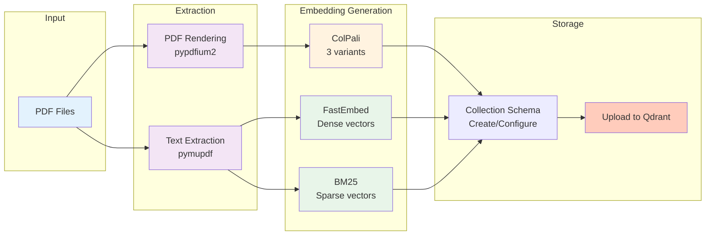

# Ingestion Module

Index PDF manuals into Qdrant with ColPali multivectors and FastEmbed embeddings.

---

## Overview

The `manuals_ingest` module handles the complete ingestion pipeline:

1. **PDF Rendering** - Convert pages to RGB images
2. **Text Extraction** - Extract per-page text
3. **Embedding Generation** - ColPali, FastEmbed, BM25
4. **Collection Creation** - Configure Qdrant schema
5. **Upload** - Batch upload to Qdrant

---

## Command-Line Interface

```bash
uv run python -m synth_rag.manuals_ingest [OPTIONS]
```

### Options

| Option | Type | Default | Description |
|--------|------|---------|-------------|
| `--subset` | choice | `test` | Which subset to ingest (`test` or `full`) |
| `--collection` | str | `midi_manuals` | Qdrant collection name |
| `--device` | choice | `mps` | Device for ColPali (`mps`, `cuda:0`, `cpu`) |
| `--batch-size` | int | `4` | Batch size for ColPali embeddings |
| `--clear-tmp` | flag | `False` | Clear tmp directories before ingestion |
| `--recreate-collection` | flag | `False` | Delete and recreate the collection |

### Examples

```bash
# Ingest test subset (recommended first)
uv run python -m synth_rag.manuals_ingest \
    --subset test \
    --collection midi_manuals \
    --device mps \
    --recreate-collection

# Ingest full collection with larger batch size
uv run python -m synth_rag.manuals_ingest \
    --subset full \
    --batch-size 8 \
    --device cuda:0
```

---

## Module Reference

::: synth_rag.manuals_ingest
    options:
      show_source: true

---

## Pipeline Details



### 1. PDF Rendering

Uses `pypdfium2` to render each PDF page to an RGB image.

### 2. Text Extraction

Uses `pymupdf` to extract text per page.

### 3. ColPali Embeddings

Generates three variants of multivectors:

- **Original**: [1030, 128] - for precise reranking
- **Row-pooled**: [32, 128] - for fast vertical matching
- **Col-pooled**: [32, 128] - for fast horizontal matching

### 4. FastEmbed + BM25

Creates dense and sparse text embeddings for hybrid search.

### 5. Collection Schema

Configures Qdrant collection with:

- Multiple named vector fields
- HNSW indexing for fast retrieval
- Sparse vectors for keyword search
- Payload metadata for results
