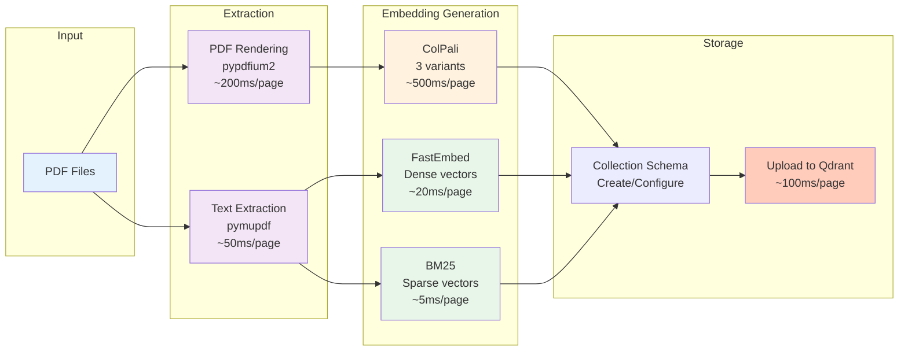

# Ingestion Module

Index PDF manuals into Qdrant with ColPali multivectors and FastEmbed embeddings.

---

## Overview

The `manuals_ingest` module handles the complete ingestion pipeline:

1. **PDF Rendering** - Convert pages to RGB images
2. **Text Extraction** - Extract per-page text
3. **Embedding Generation** - ColPali, FastEmbed, BM25
4. **Collection Creation** - Configure Qdrant schema
5. **Upload** - Batch upload to Qdrant

---

## Command-Line Interface

```bash
uv run python -m synth_rag.manuals_ingest [OPTIONS]
```

### Options

| Option | Type | Default | Description |
|--------|------|---------|-------------|
| `--subset` | choice | `test` | Which subset to ingest (`test` or `full`) |
| `--collection` | str | `midi_manuals` | Qdrant collection name |
| `--device` | choice | `mps` | Device for ColPali (`mps`, `cuda:0`, `cpu`) |
| `--batch-size` | int | `4` | Batch size for ColPali embeddings |
| `--clear-tmp` | flag | `False` | Clear tmp directories before ingestion |
| `--recreate-collection` | flag | `False` | Delete and recreate the collection |

### Examples

```bash
# Ingest test subset (recommended first)
uv run python -m synth_rag.manuals_ingest \
    --subset test \
    --collection midi_manuals \
    --device mps \
    --recreate-collection

# Ingest full collection with larger batch size
uv run python -m synth_rag.manuals_ingest \
    --subset full \
    --batch-size 8 \
    --device cuda:0

# Re-ingest with clean slate
uv run python -m synth_rag.manuals_ingest \
    --clear-tmp \
    --recreate-collection
```

---

## Module Reference

::: synth_rag.manuals_ingest
    options:
      show_source: true

---

## Pipeline Details



### 1. PDF Rendering

Uses `pypdfium2` to render each PDF page to an RGB image:

```python
import pypdfium2 as pdfium
from PIL import Image

pdf = pdfium.PdfDocument(pdf_path)
for page in pdf:
    bitmap = page.render(scale=2.0)
    pil_image = bitmap.to_pil().convert("RGB")
    # Save to tmp/pages/
```

### 2. Text Extraction

Uses `pymupdf` to extract text per page:

```python
import pymupdf

doc = pymupdf.open(pdf_path)
for page_num, page in enumerate(doc):
    text = page.get_text()
    # Save to tmp/text/
```

### 3. ColPali Embeddings

Generates three variants of multivectors:

```python
from colpali_engine.models import ColPali, ColPaliProcessor

model = ColPali.from_pretrained("vidore/colpali-v1.3")
processor = ColPaliProcessor.from_pretrained("vidore/colpali-v1.3")

# Process batch of images
batch_images = processor(images=batch, return_tensors="pt")
embeddings = model(**batch_images)  # [B, 1030, 128]

# Create variants
original = embeddings  # [1030, 128]
rows_pooled = embeddings.view(32, 32, 128).mean(dim=1)  # [32, 128]
cols_pooled = embeddings.view(32, 32, 128).mean(dim=0)  # [32, 128]
```

### 4. FastEmbed + BM25

```python
from fastembed import TextEmbedding, SparseTextEmbedding

# Dense embeddings
dense_model = TextEmbedding("sentence-transformers/all-MiniLM-L6-v2")
dense_vectors = list(dense_model.embed(chunks))

# Sparse embeddings
sparse_model = SparseTextEmbedding("Qdrant/bm25")
sparse_vectors = list(sparse_model.embed(chunks))
```

### 5. Collection Schema

```python
from qdrant_client import models

client.create_collection(
    collection_name="midi_manuals",
    vectors_config={
        # Original ColPali multivectors (no HNSW)
        "colpali_original": models.VectorParams(
            size=128,
            distance=models.Distance.COSINE,
            multivector_config=models.MultiVectorConfig(
                comparator=models.MultiVectorComparator.MAX_SIM
            ),
            on_disk=False,
        ),
        # Row-pooled ColPali (HNSW indexed)
        "colpali_rows": models.VectorParams(
            size=128,
            distance=models.Distance.COSINE,
            multivector_config=models.MultiVectorConfig(
                comparator=models.MultiVectorComparator.MAX_SIM
            ),
            hnsw_config=models.HnswConfigDiff(m=16, ef_construct=100),
            on_disk=False,
        ),
        # Col-pooled ColPali (HNSW indexed)
        "colpali_cols": models.VectorParams(
            size=128,
            distance=models.Distance.COSINE,
            multivector_config=models.MultiVectorConfig(
                comparator=models.MultiVectorComparator.MAX_SIM
            ),
            hnsw_config=models.HnswConfigDiff(m=16, ef_construct=100),
            on_disk=False,
        ),
        # Dense embeddings (HNSW indexed)
        "dense": models.VectorParams(
            size=384,
            distance=models.Distance.COSINE,
            hnsw_config=models.HnswConfigDiff(m=16, ef_construct=100),
            on_disk=False,
        ),
    },
    sparse_vectors_config={
        # Sparse BM25 embeddings
        "sparse": models.SparseVectorParams(
            modifier=models.Modifier.IDF
        ),
    },
)
```

---

## Performance

### Timing

Average time per page (Apple M2 Max, MPS):

| Stage | Time |
|-------|------|
| PDF Render | ~200ms |
| Text Extract | ~50ms |
| ColPali Embed | ~500ms |
| FastEmbed | ~20ms |
| Upload | ~100ms |
| **Total** | **~870ms** |

### Batch Processing

Processing 4 pages in parallel:

- **Without batching**: 4 × 870ms = 3,480ms
- **With batching**: ~1,200ms (2.9x speedup)

---

## Troubleshooting

### Out of Memory

Reduce batch size:
```bash
--batch-size 2
# or
--batch-size 1
```

### Collection Already Exists

Recreate collection:
```bash
--recreate-collection
```

### Slow Ingestion

Increase batch size (if memory allows):
```bash
--batch-size 8
```

Use GPU:
```bash
--device cuda:0
```

