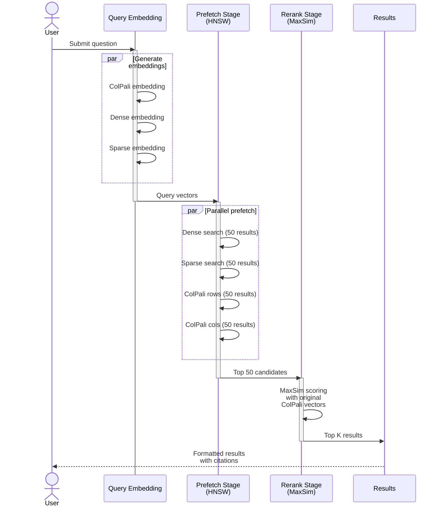
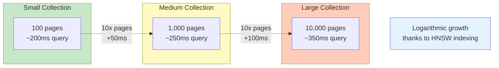

# Query Module

Query PDF manuals using hybrid search with ColPali reranking.

---

## Overview

The `manuals_query` module implements two-stage hybrid search:

1. **Prefetch Stage** - Fast retrieval using HNSW-indexed vectors
2. **Rerank Stage** - Precise reranking with original ColPali multivectors

---

## Command-Line Interface

```bash
uv run python -m synth_rag.manuals_query [OPTIONS]
```

### Options

| Option | Type | Default | Description |
|--------|------|---------|-------------|
| `--question` | str | *required* | Question to ask |
| `--collection` | str | `midi_manuals` | Qdrant collection name |
| `--top-k` | int | `5` | Number of results to return |
| `--prefetch-limit` | int | `50` | Results to prefetch for reranking |
| `--device` | choice | `mps` | Device for ColPali (`mps`, `cuda:0`, `cpu`) |
| `--manual-filter` | str | `None` | Filter by manual name (optional) |

### Examples

```bash
# Basic query
uv run python -m synth_rag.manuals_query \
    --question "How do I adjust the filter cutoff?" \
    --collection midi_manuals

# Filter by specific manual
uv run python -m synth_rag.manuals_query \
    --question "What are the MIDI CC numbers?" \
    --manual-filter "Digitone" \
    --top-k 10

# Increase prefetch for better recall
uv run python -m synth_rag.manuals_query \
    --question "Explain the synthesis engine" \
    --prefetch-limit 100 \
    --top-k 5
```

---

## Module Reference

::: synth_rag.manuals_query
    options:
      show_source: true

---

## Search Pipeline



### 1. Query Embedding

Generate embeddings for the query:

```python
from colpali_engine.models import ColPali, ColPaliProcessor
from fastembed import TextEmbedding, SparseTextEmbedding

# ColPali embeddings
model = ColPali.from_pretrained("vidore/colpali-v1.3")
processor = ColPaliProcessor.from_pretrained("vidore/colpali-v1.3")

# Create dummy image with query text
query_image = create_text_image(question)
query_colpali = model(processor(images=[query_image]))

# Dense embeddings
dense_model = TextEmbedding("sentence-transformers/all-MiniLM-L6-v2")
query_dense = list(dense_model.embed([question]))[0]

# Sparse embeddings
sparse_model = SparseTextEmbedding("Qdrant/bm25")
query_sparse = list(sparse_model.embed([question]))[0]
```

### 2. Hybrid Search

Combine multiple search strategies:

```python
from qdrant_client import models

results = client.query_points(
    collection_name="midi_manuals",
    prefetch=[
        # Dense semantic search
        models.Prefetch(
            query=query_dense,
            using="dense",
            limit=prefetch_limit,
        ),
        # Sparse keyword search
        models.Prefetch(
            query=query_sparse,
            using="sparse",
            limit=prefetch_limit,
        ),
        # ColPali row-pooled search
        models.Prefetch(
            query=rows_pooled,
            using="colpali_rows",
            limit=prefetch_limit,
        ),
        # ColPali col-pooled search
        models.Prefetch(
            query=cols_pooled,
            using="colpali_cols",
            limit=prefetch_limit,
        ),
    ],
    # Rerank with original ColPali multivectors
    query=models.Query(
        vector=original_colpali,
        using="colpali_original",
        rescorer=models.MaxSimRescorer(),
    ),
    limit=top_k,
)
```

### 3. Result Formatting

Pretty-print results:

```
=== QUERY RESULTS ===

Question: How do I adjust the filter cutoff?
Collection: midi_manuals
Top-K: 5

─────────────────────────────────────────

[Result 1/5] Score: 0.8234

Manual: Digitone-2-User-Manual_ENG_OS1.10D_251022
Page: 67

Text Snippet:
FILTER SETTINGS

The filter cutoff determines the frequency at which the filter begins
to attenuate the signal. To adjust:

1. Press [FUNC] + [FLTR]
2. Turn encoder A to adjust CUTOFF (0-127)
3. Turn encoder B to adjust RESONANCE (0-127)

The cutoff can also be modulated by the envelopes and LFOs.

─────────────────────────────────────────
```

---

## Query Logs

All queries are logged to `logs/manuals_queries/<timestamp>.json`:

```json
{
  "timestamp": "2025-11-27T10:30:45",
  "question": "How do I adjust the filter cutoff?",
  "collection": "midi_manuals",
  "top_k": 5,
  "prefetch_limit": 50,
  "manual_filter": null,
  "results": [
    {
      "id": "uuid-here",
      "score": 0.8234,
      "manual_name": "Digitone-2-User-Manual",
      "page_num": 67,
      "text_snippet": "FILTER SETTINGS..."
    }
  ]
}
```

---

## Performance

### Query Timing

Average query time (collection with 1,000 pages):

| Stage | Time |
|-------|------|
| Embed query | ~100ms |
| Prefetch (50 results) | ~50ms |
| Rerank (top 5) | ~100ms |
| **Total** | **~250ms** |

### Scaling

Query time vs collection size:



**Scaling Table:**

| Pages | Query Time |
|-------|------------|
| 100 | ~200ms |
| 1,000 | ~250ms |
| 10,000 | ~350ms |

Logarithmic growth due to HNSW indexing.

---

## Tuning Tips

### Prefetch Limit

- **Small (20-30)**: Fast, may miss relevant pages
- **Medium (50)**: Balanced (default)
- **Large (100+)**: Better recall, slower

### Top-K

- **Small (3-5)**: Focused results
- **Large (10+)**: Exploratory queries

### Manual Filter

Use when you know which manual to search:
```bash
--manual-filter "Digitone"
```

Significantly speeds up queries by reducing search space.

---

## Troubleshooting

### No Results

Increase prefetch limit:
```bash
--prefetch-limit 100
```

Check collection has data:
```python
from synth_rag.settings import get_qdrant_client
client = get_qdrant_client()
info = client.get_collection("midi_manuals")
print(f"Points: {info.points_count}")
```

### Poor Results

Try rephrasing the question to be more specific.

Increase top-k:
```bash
--top-k 10
```

### Slow Queries

Reduce prefetch limit:
```bash
--prefetch-limit 30
```

Use manual filter:
```bash
--manual-filter "Digitone"
```

