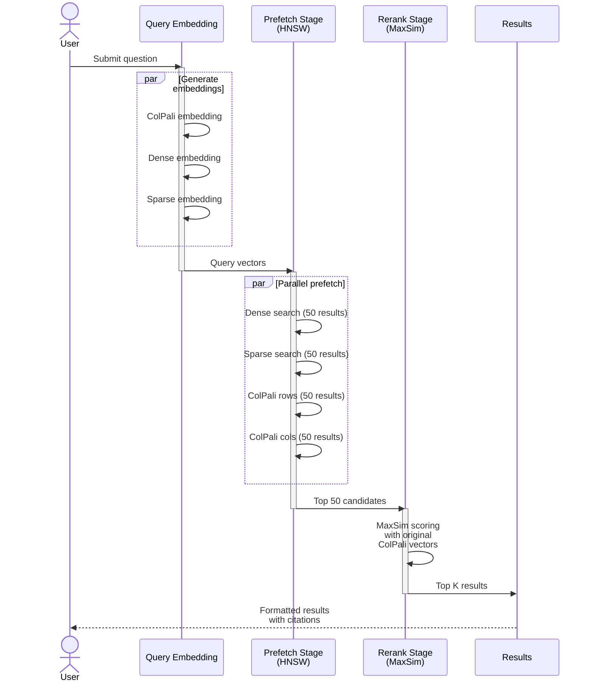

# Query Module

Query PDF manuals using hybrid search with ColPali reranking.

---

## Overview

The `manuals_query` module implements two-stage hybrid search:

1. **Prefetch Stage** - Fast retrieval using HNSW-indexed vectors
2. **Rerank Stage** - Precise reranking with original ColPali multivectors

---

## Command-Line Interface

```bash
uv run python -m synth_rag.manuals_query [OPTIONS]
```

### Options

| Option | Type | Default | Description |
|--------|------|---------|-------------|
| `--question` | str | *required* | Question to ask |
| `--collection` | str | `midi_manuals` | Qdrant collection name |
| `--top-k` | int | `5` | Number of results to return |
| `--prefetch-limit` | int | `50` | Results to prefetch for reranking |
| `--device` | choice | `mps` | Device for ColPali (`mps`, `cuda:0`, `cpu`) |
| `--manual-filter` | str | `None` | Filter by manual name (optional) |

### Examples

```bash
# Basic query
uv run python -m synth_rag.manuals_query \
    --question "How do I adjust the filter cutoff?" \
    --collection midi_manuals

# Filter by specific manual
uv run python -m synth_rag.manuals_query \
    --question "What are the MIDI CC numbers?" \
    --manual-filter "Digitone" \
    --top-k 10
```

---

## Module Reference

::: synth_rag.manuals_query
    options:
      show_source: true

---

## Search Pipeline



### How It Works

1. **Query Embedding**: Generate ColPali, dense, and sparse embeddings for the question
2. **Hybrid Search**: Combine multiple search strategies in parallel
3. **Rerank**: Use original ColPali multivectors with MaxSim scoring
4. **Format Results**: Pretty-print with manual names, pages, and snippets

---

## Query Logs

All queries are logged to `logs/manuals_queries/<timestamp>.json` with:

- Question
- Timestamp
- Collection name
- Top-K and prefetch settings
- All results with scores and metadata

---

## Tuning Tips

### Prefetch Limit

- **Small (20-30)**: Fast, may miss relevant pages
- **Medium (50)**: Balanced (default)
- **Large (100+)**: Better recall, slower

### Top-K

- **Small (3-5)**: Focused results
- **Large (10+)**: Exploratory queries

### Manual Filter

Use when you know which manual to search:

```bash
--manual-filter "Digitone"
```
