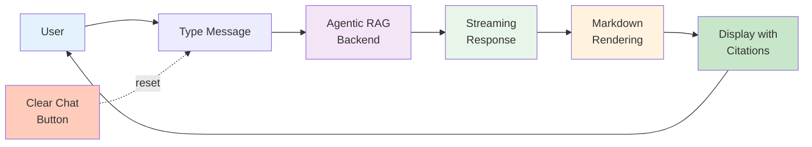

# UI Module

Gradio web interface for the Synth-RAG chatbot.

---

## Overview

The `manuals_ui` module provides a web-based chat interface using Gradio. It integrates the agentic RAG workflow with a user-friendly UI.

---

## Quick Start

### Launch UI

```bash
uv run python -m synth_rag.manuals_ui
```

Opens automatically in browser at `http://localhost:7860`.

---

## Module Reference

::: synth_rag.manuals_ui
    options:
      show_source: true

---

## Features

### Chat Interface



**Features:**

- **Multi-turn conversations**: Context is maintained across messages
- **Streaming responses**: Real-time token-by-token generation
- **Markdown rendering**: Formatted responses with citations
- **Clear chat**: Reset conversation history

---

## Configuration

### Default Settings

- Collection: `midi_manuals`
- Model: `gpt-4o-mini`
- Device: `mps` (auto-detected)
- Top-K: 3

### Customization

Modify `manuals_ui.py` to change defaults:

```python
COLLECTION_NAME = "my_custom_collection"
MODEL_NAME = "gpt-4o"
DEVICE = "cuda:0"
```
