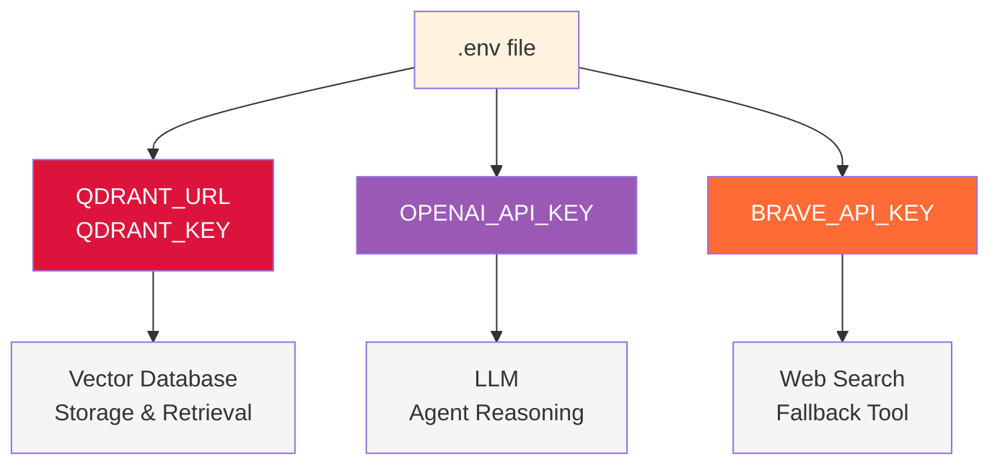
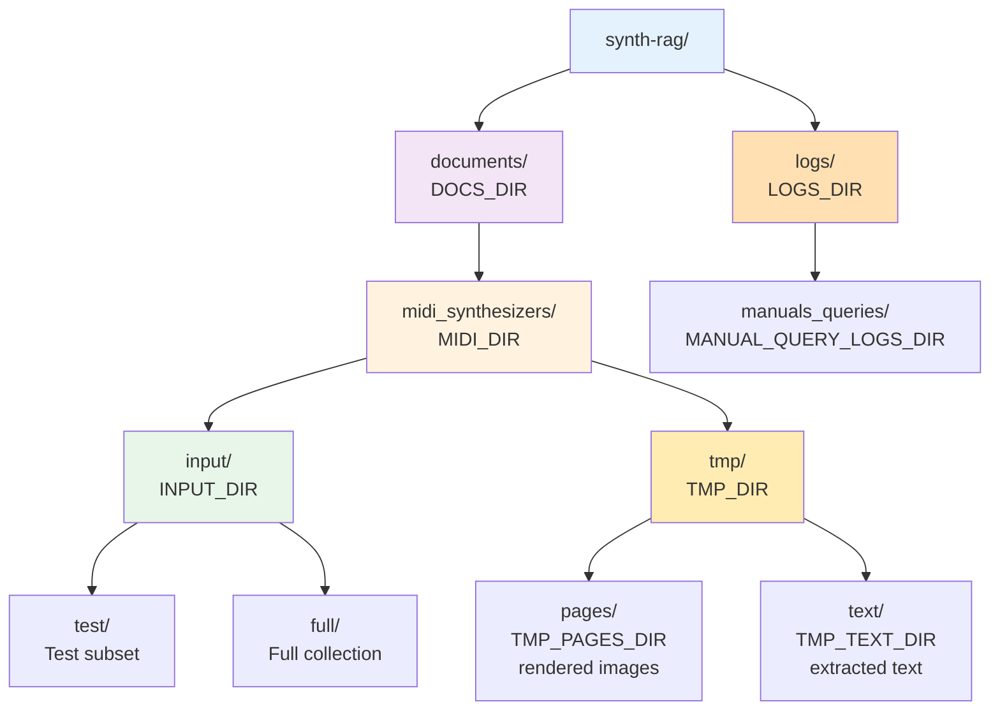

# Settings Module

Configuration and utility functions for Synth-RAG.

---

## Overview

The `settings` module provides:

- **API configuration** - Loads credentials from `.env` file
- **Directory paths** - Centralized path management
- **Client factories** - Singleton Qdrant client
- **Utility functions** - Path validation, directory creation

---

## Module Reference

::: synth_rag.settings
    options:
      show_source: true
      members:
        - APISettings
        - get_api_settings
        - get_qdrant_client
        - get_manual_input_dir
        - ensure_tmp_dirs
        - ensure_logs_dir
        - REPO_ROOT
        - DOCS_DIR
        - MIDI_DIR
        - INPUT_DIR
        - TMP_DIR
        - TMP_PAGES_DIR
        - TMP_TEXT_DIR
        - LOGS_DIR
        - MANUAL_QUERY_LOGS_DIR

---

## Usage Examples

### Load API Settings

```python
from synth_rag.settings import get_api_settings

settings = get_api_settings()
print(settings.qdrant_url)
print(settings.openai_key)
```

### Get Qdrant Client

```python
from synth_rag.settings import get_qdrant_client

client = get_qdrant_client()
collections = client.get_collections()
```

### Work with Directories

```python
from synth_rag.settings import get_manual_input_dir, ensure_tmp_dirs

# Get input directory for test subset
test_dir = get_manual_input_dir("test")

# Ensure tmp directories exist
pages_dir, text_dir = ensure_tmp_dirs(clear=True)
```

---

## Environment Variables



**Required Variables:**

| Variable | Description | Example |
|----------|-------------|---------|
| `QDRANT_URL` | Qdrant cluster URL | `https://xyz.aws.cloud.qdrant.io:6333` |
| `QDRANT_KEY` | Qdrant API key | `your-api-key-here` |
| `OPENAI_API_KEY` | OpenAI API key | `sk-...` |
| `BRAVE_API_KEY` | Brave Search API key | `BSA...` |

---

## Directory Structure


