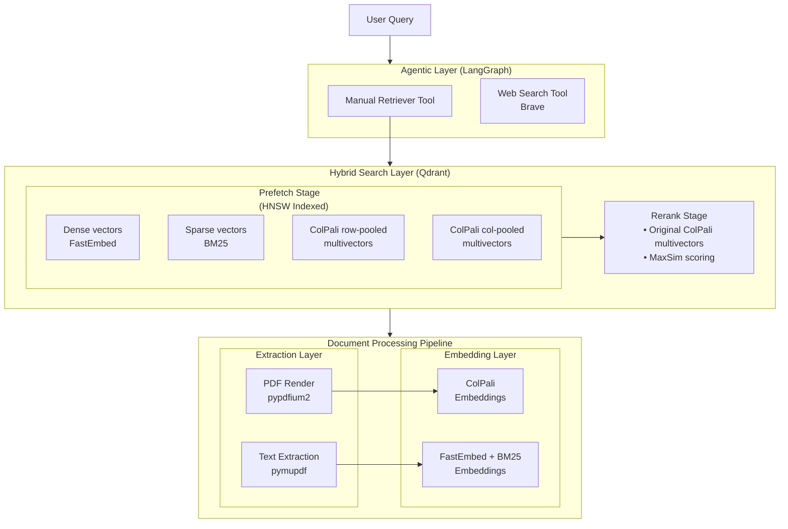
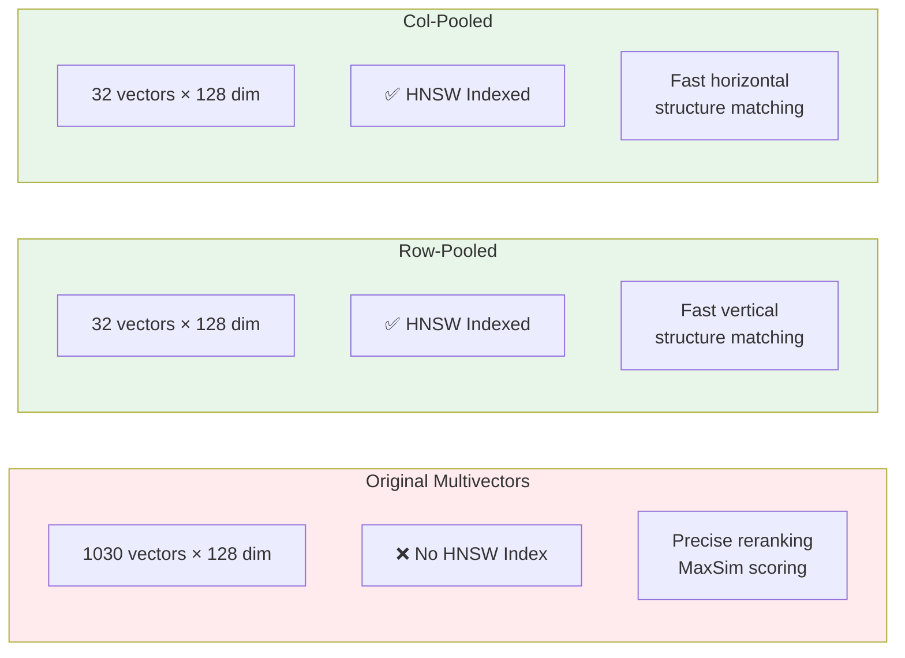
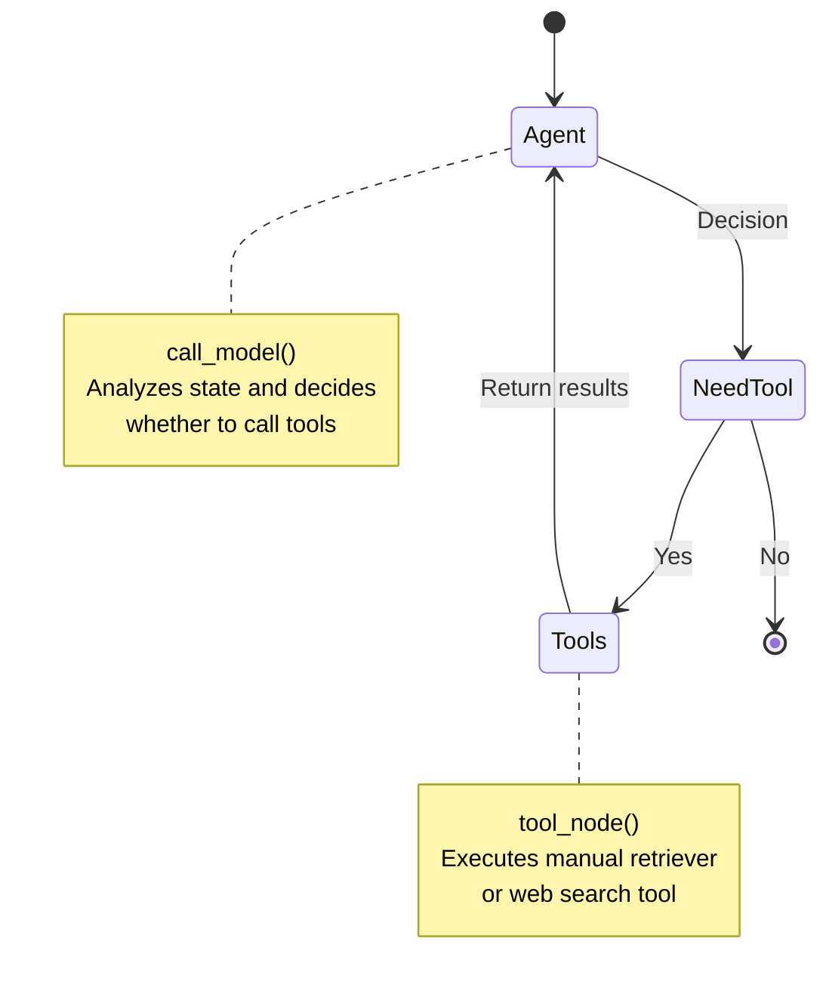
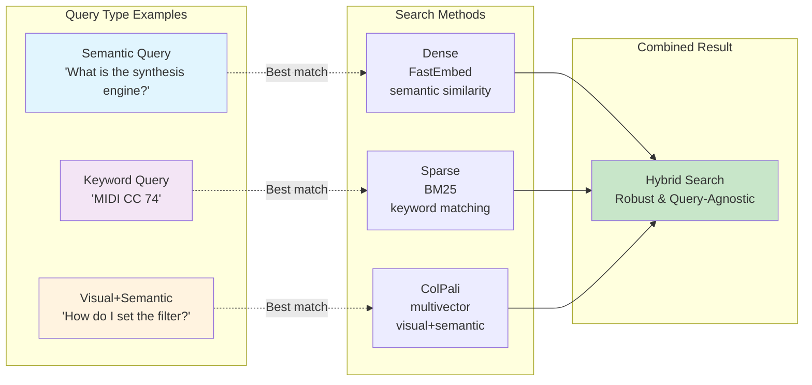

---
hide:
  - navigation
---

# Architecture

## System Overview



---

## Core Components

### 1. Document Processing

#### PDF Rendering (`pypdfium2`)

Converts each PDF page to an RGB image for ColPali processing:

```python
def render_pdf_to_images(pdf_path: Path) -> list[Image]:
    pdf = pdfium.PdfDocument(pdf_path)
    images = []
    for page in pdf:
        bitmap = page.render(scale=2.0)
        pil_image = bitmap.to_pil()
        images.append(pil_image.convert("RGB"))
    return images
```

**Why render to images?**

ColPali is a vision-language model that processes PDFs as images, capturing:

- Visual layout and structure
- Tables, diagrams, and figures
- Font styling and emphasis
- Spatial relationships

#### Text Extraction (`pymupdf`)

Extracts plain text per page for:

1. Dense/sparse text embeddings
2. Payload metadata in search results
3. Human-readable snippets

---

### 2. Embedding Generation

#### ColPali Multivectors

ColPali generates **~1,030 vectors per page** (32×32 patches + special tokens):

```python
# Original multivectors: [1030, 128]
original_multivectors = colpali_model(image)

# Mean-pooled variants for faster indexing
row_pooled = original_multivectors.reshape(32, 32, 128).mean(axis=1)  # [32, 128]
col_pooled = original_multivectors.reshape(32, 32, 128).mean(axis=0)  # [32, 128]
```

**Why three variants?**



#### Dense Embeddings (FastEmbed)

384-dimensional vectors using `all-MiniLM-L6-v2`:

```python
dense_model = TextEmbedding("sentence-transformers/all-MiniLM-L6-v2")
dense_vectors = list(dense_model.embed(text_chunks))
```

**Chunking strategy**: Semantic text splitter with 512-token chunks, 50-token overlap.

#### Sparse Embeddings (BM25)

Keyword-based retrieval with IDF weighting:

```python
sparse_model = SparseTextEmbedding("Qdrant/bm25")
sparse_vectors = list(sparse_model.embed(text_chunks))
```

---

### 3. Qdrant Collection Schema

Each page is stored as a point with multiple named vectors:

```python
{
    "id": "<uuid>",
    "payload": {
        "manual_name": "Digitone-2-User-Manual",
        "page_num": 42,
        "page_text": "MIDI Settings...",
        "pdf_path": "/path/to/manual.pdf",
    },
    "vectors": {
        "colpali_original": [1030 x 128],  # No HNSW
        "colpali_rows": [32 x 128],         # HNSW indexed
        "colpali_cols": [32 x 128],         # HNSW indexed
        "dense": [384],                     # HNSW indexed
        "sparse": {indices: [...], values: [...]}  # Inverted index
    }
}
```

---

### 4. Hybrid Search & Reranking

#### Two-Stage Retrieval

**Stage 1: Prefetch (Fast)**

Uses HNSW-indexed vectors to retrieve top-N candidates:

```python
client.query_points(
    collection_name="midi_manuals",
    prefetch=[
        models.Prefetch(query=dense_vector, using="dense", limit=50),
        models.Prefetch(query=sparse_vector, using="sparse", limit=50),
        models.Prefetch(query=colpali_rows, using="colpali_rows", limit=50),
        models.Prefetch(query=colpali_cols, using="colpali_cols", limit=50),
    ],
    # ... rerank configuration
)
```

**Stage 2: Rerank (Precise)**

Uses original ColPali multivectors with MaxSim scoring:

```python
query=models.Query(
    vector=original_colpali_query,  # [1030, 128]
    using="colpali_original",
    rescorer=models.MaxSimRescorer(),
)
```

#### MaxSim Scoring

For each query vector \(q_i\), find the maximum similarity with document vectors:

\[
\text{MaxSim}(Q, D) = \sum_{i=1}^{|Q|} \max_{j=1}^{|D|} \text{sim}(q_i, d_j)
\]

---

### 5. Agentic Layer (LangGraph)

#### State Graph



#### Agent Implementation

```python
class State(TypedDict):
    messages: Annotated[list, lambda x, y: x + y]

workflow = StateGraph(State)
workflow.add_node("agent", call_model)
workflow.add_node("tools", tool_node)
workflow.add_edge(START, "agent")
workflow.add_conditional_edges("agent", should_continue)
workflow.add_edge("tools", "agent")
```

#### Agent Tools

**1. Manual Retriever Tool**

```python
@tool
def manuals_retriever_tool(query: str) -> str:
    """Retrieve information from MIDI synthesizer manuals."""
    results = search_manuals(query)
    return format_results_with_citations(results)
```

**2. Web Search Tool**

```python
@tool
def web_search_tool(query: str) -> str:
    """Search the web using Brave Search API."""
    response = brave_client.search(q=query, count=5)
    return format_web_results(response)
```

#### Agent Behavior

The system prompt ensures:

1. **Always call manuals first** - No exceptions
2. **Cite sources** - Format: `(Manual Name, Page X)`
3. **Structure responses** - Manuals section, then web results
4. **Web as fallback** - Only if manual search fails

---

## Design Decisions

### Why ColPali?

Traditional OCR-based approaches lose:

- Visual layout information
- Table structures
- Diagrams and figures
- Font emphasis (bold, italic)

ColPali processes PDFs as images, preserving all visual information.

### Why Two-Stage Retrieval?

Indexing 1,030-dimensional multivectors with HNSW is slow and memory-intensive. Mean-pooling provides a **fast approximation** for prefetch, then MaxSim reranks precisely.

### Why Hybrid Search?



Different search methods excel at different queries:

- **Dense**: "What is the synthesis engine?" (semantic)
- **Sparse**: "MIDI CC 74" (keywords)
- **ColPali**: "How do I set the filter?" (visual + semantic)

Combining all three provides **robust, query-agnostic** retrieval.

---

## Next Steps

- [Usage Guide](usage.md) - Use the system
- [API Reference](api/settings.md) - Explore the code
