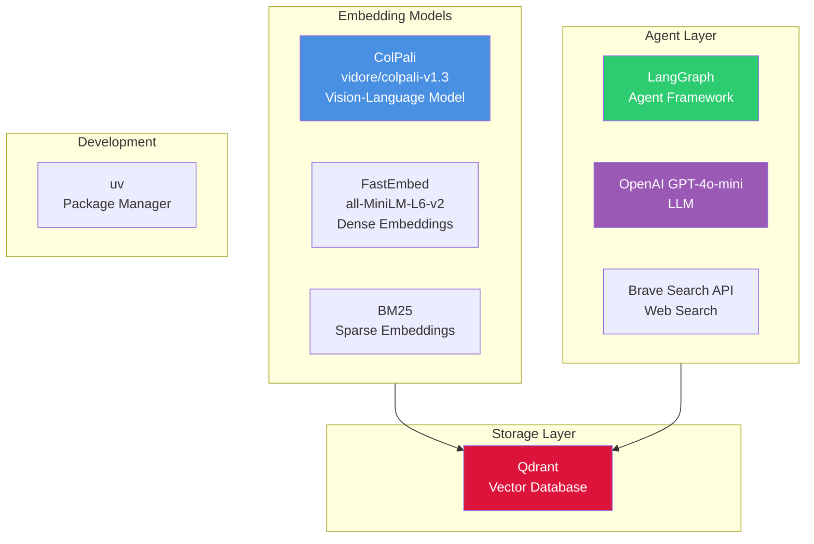

# Synth-RAG

**A retrieval-augmented generation (RAG) system for querying PDF manuals of MIDI synthesizers using ColPali multivector embeddings, hybrid search, and agentic workflows with LangGraph.**

---

## Overview

Synth-RAG is a sophisticated RAG system designed specifically for technical PDF manuals. It leverages cutting-edge vision-language models and hybrid search techniques to provide accurate, grounded answers about MIDI synthesizers and their operation.

## Key Features

### 🖼️ ColPali Multivector Embeddings
Uses Vision Language Models to process PDF pages directly as images, capturing visual layout and formatting information that traditional text extraction misses.

### 🔍 Hybrid Search
Combines three complementary search methods:

- **Dense vectors** (FastEmbed) for semantic similarity
- **Sparse vectors** (BM25) for keyword matching
- **Multivector representations** (ColPali) for visual-semantic understanding

### ⚡ Two-Stage Retrieval
- **First Stage**: Fast prefetch using HNSW-indexed mean-pooled vectors
- **Second Stage**: Precise reranking using original ColPali multivectors

This provides **10x faster indexing** compared to indexing original multivectors directly, while maintaining comparable retrieval quality.

### 🤖 Agentic RAG
LangGraph-powered agent that can:

- Query local manual collections
- Fall back to web search when needed
- Provide cited, grounded answers
- Handle multi-step reasoning

### 📈 Scalable
Optimized for large PDF collections (20,000+ pages) with efficient indexing and retrieval strategies.

---

## Quick Example

```bash
# Ingest manuals
uv run python -m synth_rag.manuals_ingest \
    --subset test \
    --collection midi_manuals

# Query with hybrid search
uv run python -m synth_rag.manuals_query \
    --question "How do I set up MIDI channels on the Digitone II?" \
    --collection midi_manuals

# Use agentic workflow
uv run python -m synth_rag.manuals_agent \
    --question "What are the differences between Digitakt and Digitone?" \
    --collection midi_manuals
```

---

## Use Cases

- **Musicians**: Quickly find specific settings and configurations in dense technical manuals
- **Developers**: Build chatbots for technical documentation
- **Researchers**: Test and benchmark RAG systems on visual-rich PDFs

---

## Technology Stack



---

## Next Steps

- [Quickstart Guide](quickstart.md) - Get up and running in minutes
- [Setup Instructions](setup.md) - Detailed installation guide
- [Usage Examples](usage.md) - Learn how to use each component
- [Architecture](architecture.md) - Understand the system design
- [API Reference](api/settings.md) - Explore the codebase

---

## Project Status

This is an active research project demonstrating state-of-the-art RAG techniques for visual-rich technical documentation.
