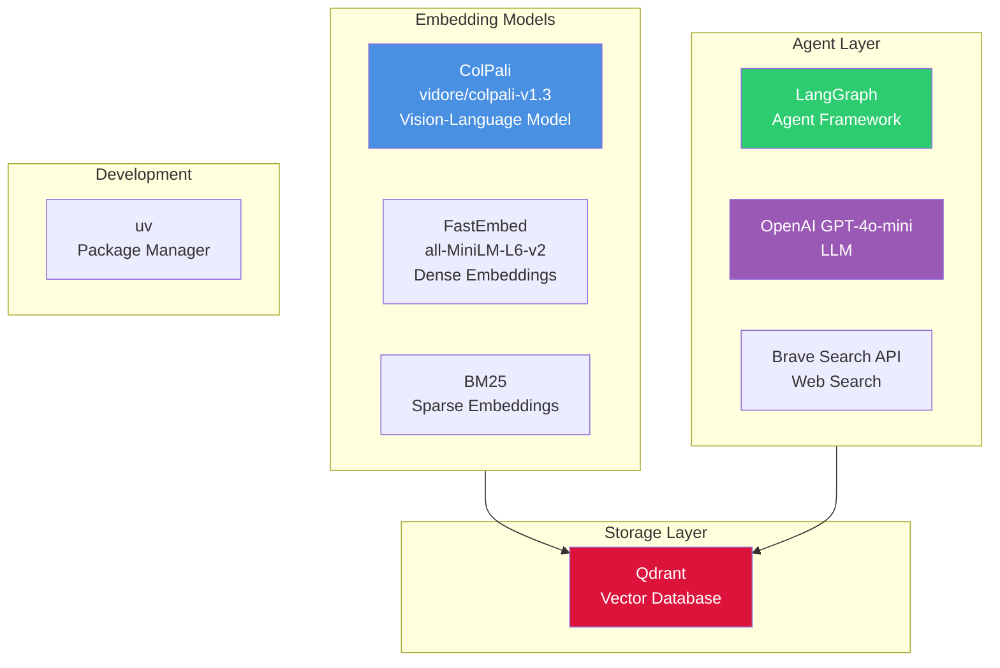

# Synth-RAG

A retrieval-augmented generation (RAG) system for querying PDF manuals of MIDI synthesizers using ColPali multivector embeddings, hybrid search, and agentic workflows with LangGraph.

<div style="max-width: 600px; margin: 0 auto;">
  <div style="position: relative; padding-bottom: 100%; height: 0;">
    <iframe id="js_video_iframe" src="https://jumpshare.com/embed/ZuUYyPeYZe3fpdPzjMwQ" frameborder="0" webkitallowfullscreen mozallowfullscreen allowfullscreen style="position: absolute; top: 0; left: 0; width: 100%; height: 100%;"></iframe>
  </div>
</div>

## Key Features

- **ColPali Multivector Embeddings** - Vision Language Models process PDF pages as images
- **Hybrid Search** - Combines dense (FastEmbed), sparse (BM25), and multivector representations
- **Two-Stage Retrieval** - Fast prefetch with HNSW-indexed vectors, precise reranking with ColPali
- **Agentic RAG** - LangGraph-powered agent with manual search and web fallback
- **Scalable** - Optimized for large PDF collections

## Quick Example

```bash
# Ingest manuals
uv run python -m synth_rag.manuals_ingest --subset test --collection midi_manuals

# Query with hybrid search
uv run python -m synth_rag.manuals_query \
    --question "How do I set up MIDI channels on the Digitone II?"

# Use agentic workflow
uv run python -m synth_rag.manuals_agent \
    --question "What are the differences between Digitakt and Digitone?"
```

---

## Technology Stack



---

## Next Steps

- [Quickstart Guide](quickstart.md) - Get up and running
- [Setup Instructions](setup.md) - Installation guide
- [Usage Examples](usage.md) - Learn how to use each component
- [Architecture](architecture.md) - Understand the system design
- [Benchmarking Guide](benchmarking.md) - Evaluate performance with RAGBench
- [API Reference](api/settings.md) - Explore the codebase
