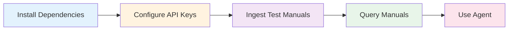

# Quickstart

## **Prerequisites**

- Python 3.13+
- [uv](https://docs.astral.sh/uv/) package manager
- API keys for Qdrant, OpenAI, and Brave Search

---

## **Installation**

1. Clone and install:

```bash
git clone https://github.com/adbX/synth-rag.git
cd synth-rag
uv sync
```

2. Create `.env` file:

```bash
cat <<'EOF' > .env
QDRANT_URL="https://<your-qdrant-cluster>"
QDRANT_KEY="<your-api-key>"
OPENAI_API_KEY="<your-openai-key>"
BRAVE_API_KEY="<your-brave-key>"
EOF
```

3. Verify installation:

```bash
uv run python -c "import torch; print('Torch:', torch.__version__)"
uv run python -c "from colpali_engine.models import ColPali; print('ColPali ready')"
uv run python -c "from qdrant_client import QdrantClient; print('Qdrant client ok')"
```

---

## **Basic Usage**



### **Step 1: Ingest Test Manuals**

```bash
uv run python -m synth_rag.manuals_ingest \
    --subset test \
    --collection midi_manuals \
    --device mps \
    --recreate-collection \
    --clear-tmp
```

!!! tip "Device Selection"
    - `--device mps` for Apple Silicon (M1/M2/M3)
    - `--device cuda:0` for NVIDIA GPUs
    - `--device cpu` as fallback

### **Step 2: Query the Manuals**

```bash
uv run python -m synth_rag.manuals_query \
    --question "How do I adjust reverb settings on the Digitone II?" \
    --collection midi_manuals \
    --top-k 5 \
    --device mps
```

### **Step 3: Use the Agent**

```bash
uv run python -m synth_rag.manuals_agent \
    --question "What are the key differences between Digitakt and Digitone?" \
    --collection midi_manuals \
    --model gpt-4o-mini \
    --device mps
```

## **Benchmarking**

Ingesting the RAGBench `emanual` dataset:

```bash
uv run python -m synth_rag.benchmark_ingest \
    --dataset emanual \
    --split all \
    --collection ragbench_emanual \
    --recreate-collection
```

<div style="position: relative; padding-bottom: 56.25%; height: 0;"><iframe id="js_video_iframe" src="https://jumpshare.com/embed/jXbKbukrL5QbcextcHiQ" frameborder="0" webkitallowfullscreen mozallowfullscreen allowfullscreen style="position: absolute; top: 0; left: 0; width: 100%; height: 100%;"></iframe></div>

Evaluating the results of the RAGBench `emanual` dataset:

<div style="position: relative; padding-bottom: 56.25%; height: 0;"><iframe id="js_video_iframe" src="https://jumpshare.com/embed/GtThOHIS6Csq619rOmp3" frameborder="0" webkitallowfullscreen mozallowfullscreen 
allowfullscreen style="position: absolute; top: 0; left: 0; width: 100%; height: 100%;"></iframe></div>

More information on benchmarking can be found on the [Benchmarking](benchmarking.md) page.

---

## **Next Steps**

- [Setup Guide](setup.md) - Detailed configuration
- [Usage Guide](usage.md) - Explore all features
- [Architecture](architecture.md) - Understand the system
