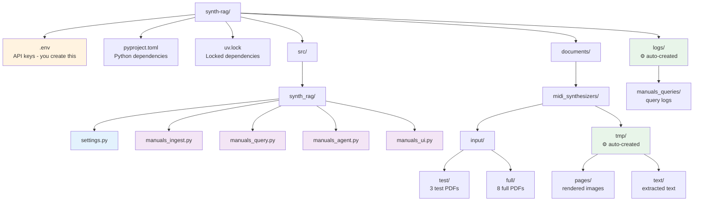
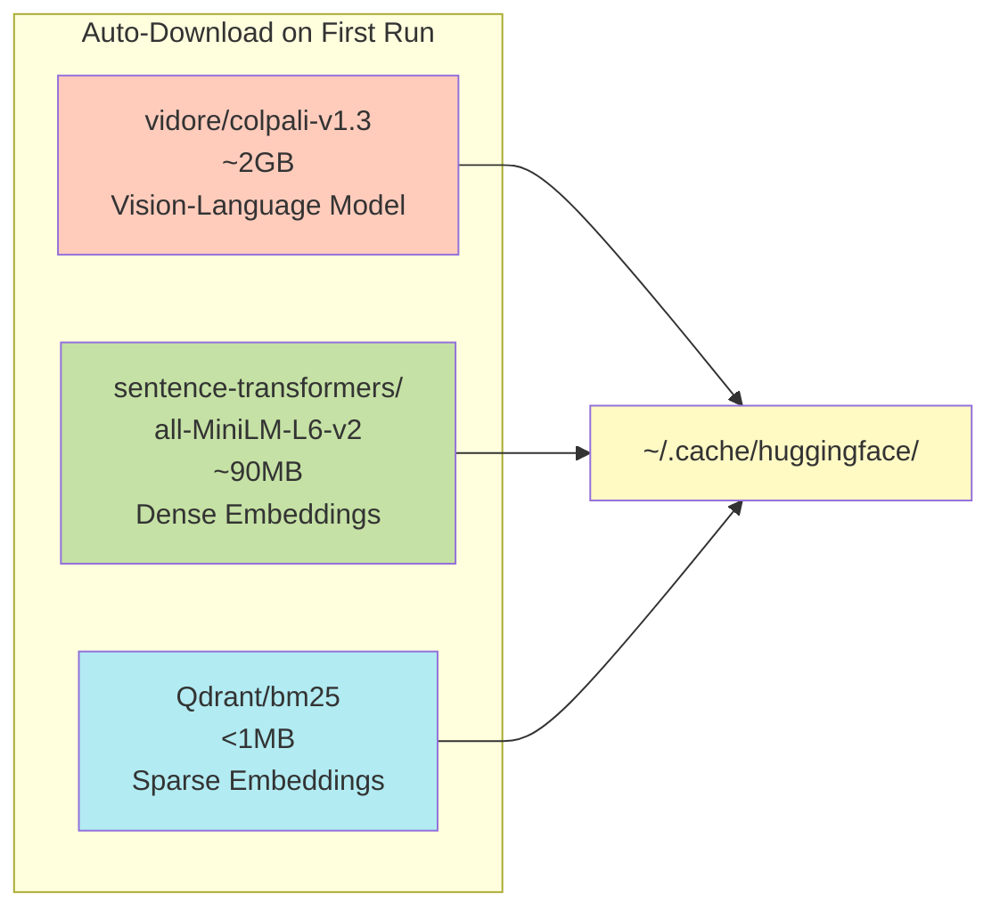

---
hide:
  - navigation
---

# Setup Guide

## System Requirements

- **Python**: 3.13 or higher
- **Package Manager**: [uv](https://docs.astral.sh/uv/)
- **GPU** (optional): Apple Silicon (MPS) or NVIDIA GPU (CUDA)

---

## Installation

### 1. Clone Repository

```bash
git clone https://github.com/adbX/synth-rag.git
cd synth-rag
```

### 2. Install Dependencies

```bash
uv sync
```

### 3. Configure API Keys

Create a `.env` file:

```ini
# Qdrant Vector Database
QDRANT_URL="https://xyz-example.eu-central.aws.cloud.qdrant.io:6333"
QDRANT_KEY="your-qdrant-api-key-here"

# OpenAI (for LLM)
OPENAI_API_KEY="sk-your-openai-key-here"

# Brave Search (for web search)
BRAVE_API_KEY="your-brave-search-key-here"
```

#### Getting API Keys

=== "Qdrant"
    Sign up at [cloud.qdrant.io](https://cloud.qdrant.io/)

=== "OpenAI"
    Visit [platform.openai.com](https://platform.openai.com/)

=== "Brave Search"
    Go to [brave.com/search/api](https://brave.com/search/api/)

---

## Directory Structure



---

## Device Configuration

### Apple Silicon (M1/M2/M3)

```bash
--device mps
```

### NVIDIA GPU

```bash
--device cuda:0
```

### CPU Only

```bash
--device cpu
```

---

## Model Downloads



**Model Summary:**

| Model | Size | Purpose |
|-------|------|---------|
| `vidore/colpali-v1.3` | ~2GB | ColPali vision-language model |
| `sentence-transformers/all-MiniLM-L6-v2` | ~90MB | Dense text embeddings |
| `Qdrant/bm25` | <1MB | Sparse keyword embeddings |

---

## Next Steps

- [Usage Guide](usage.md) - Learn how to use each component
- [Quickstart](quickstart.md) - Run your first queries
- [Architecture](architecture.md) - Understand the system design
