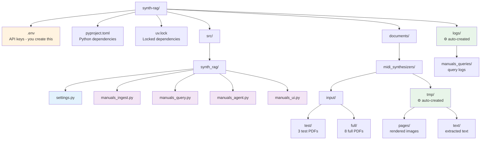
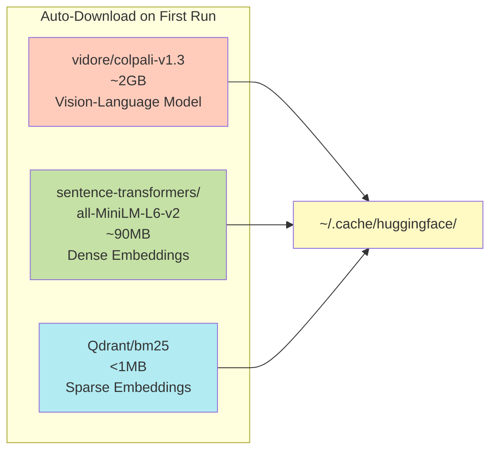

# Setup Guide

Complete setup instructions for Synth-RAG.

---

## System Requirements

### Hardware
- **CPU**: Any modern x86_64 or ARM64 processor
- **RAM**: 8GB minimum, 16GB+ recommended
- **GPU** (optional): Apple Silicon (MPS) or NVIDIA GPU (CUDA)
- **Storage**: 5GB+ for models and data

### Software
- **Python**: 3.13 or higher
- **Package Manager**: [uv](https://docs.astral.sh/uv/)
- **Operating System**: macOS, Linux, or WSL2 on Windows

---

## Installation

### 1. Clone Repository

```bash
git clone https://github.com/adbX/synth-rag.git
cd synth-rag
```

### 2. Install Dependencies

Using `uv` (recommended):

```bash
uv sync
```

This installs all dependencies from `pyproject.toml` and creates a virtual environment automatically.

### 3. Configure API Keys

Create a `.env` file in the project root:

```bash
touch .env
```

Add your API credentials:

```ini
# Qdrant Vector Database
QDRANT_URL="https://xyz-example.eu-central.aws.cloud.qdrant.io:6333"
QDRANT_KEY="your-qdrant-api-key-here"

# OpenAI (for LLM)
OPENAI_API_KEY="sk-your-openai-key-here"

# Brave Search (for web search)
BRAVE_API_KEY="your-brave-search-key-here"
```

#### Getting API Keys

=== "Qdrant"
    1. Sign up at [cloud.qdrant.io](https://cloud.qdrant.io/)
    2. Create a free cluster
    3. Copy the cluster URL and API key

=== "OpenAI"
    1. Visit [platform.openai.com](https://platform.openai.com/)
    2. Create an API key
    3. Add billing information

=== "Brave Search"
    1. Go to [brave.com/search/api](https://brave.com/search/api/)
    2. Sign up for free tier (2,000 queries/month)
    3. Get your API key

---

## Verify Installation

Run these verification commands:

```bash
# 1. Check Python version
python --version  # Should be 3.13+

# 2. Check PyTorch
uv run python -c "import torch; print('Torch:', torch.__version__)"

# 3. Check ColPali
uv run python -c "from colpali_engine.models import ColPali; print('ColPali ready')"

# 4. Check Qdrant
uv run python -c "from qdrant_client import QdrantClient; print('Qdrant client ok')"

# 5. Check environment variables
uv run python -c "from synth_rag.settings import get_api_settings; settings = get_api_settings(); print('API settings loaded successfully')"
```

If all commands succeed, you're ready to go! ✅

---

## Directory Structure

The system expects this structure:



!!! note
    The `tmp/` and `logs/` directories are created automatically when needed.

---

## Device Configuration

### Apple Silicon (M1/M2/M3)

Use the `mps` device for GPU acceleration:

```bash
uv run python -m synth_rag.manuals_ingest --device mps
```

### NVIDIA GPU

Use CUDA device:

```bash
uv run python -m synth_rag.manuals_ingest --device cuda:0
```

To use a specific GPU, change the device number:
```bash
--device cuda:1  # Use GPU 1
```

### CPU Only

Fallback to CPU (slower):

```bash
uv run python -m synth_rag.manuals_ingest --device cpu
```

---

## Model Downloads

On first run, the following models will be downloaded automatically:



**Model Summary:**

| Model | Size | Purpose |
|-------|------|---------|
| `vidore/colpali-v1.3` | ~2GB | ColPali vision-language model |
| `sentence-transformers/all-MiniLM-L6-v2` | ~90MB | Dense text embeddings |
| `Qdrant/bm25` | <1MB | Sparse keyword embeddings |

Models are cached in `~/.cache/huggingface/` by default.

---

## Next Steps

- [Usage Guide](usage.md) - Learn how to use each component
- [Quickstart](quickstart.md) - Run your first queries
- [Architecture](architecture.md) - Understand the system design

