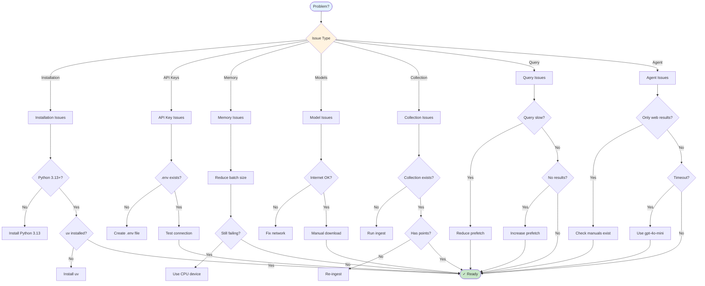
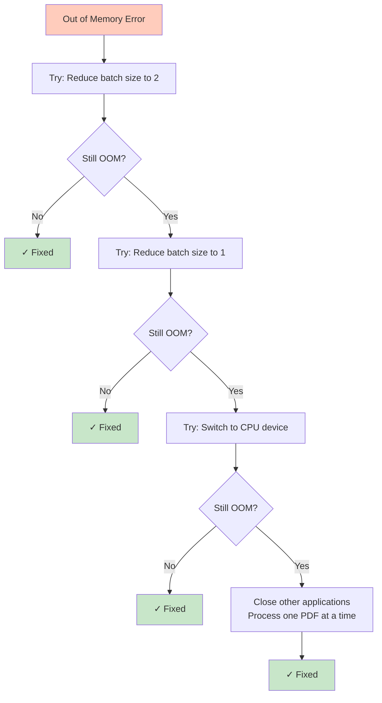

# Troubleshooting

Common issues and their solutions.

---

## Quick Diagnostic Flowchart



---

## Installation Issues

### Python Version Mismatch

**Error**: `RuntimeError: Python 3.13+ required`

**Solution**:
```bash
# Check version
python --version

# Install Python 3.13+ using pyenv
pyenv install 3.13
pyenv local 3.13
```

### uv Command Not Found

**Error**: `command not found: uv`

**Solution**:
```bash
# Install uv
curl -LsSf https://astral.sh/uv/install.sh | sh

# Or via pip
pip install uv
```

---

## API Key Issues

### Missing Environment Variables

**Error**: `RuntimeError: Missing required environment variable: QDRANT_URL`

**Solution**:
```bash
# Verify .env file exists
cat .env

# Check variables are loaded
uv run python -c "import os; from dotenv import load_dotenv; load_dotenv(); print(os.getenv('QDRANT_URL'))"
```

Make sure your `.env` file contains:
```ini
QDRANT_URL="https://..."
QDRANT_KEY="..."
OPENAI_API_KEY="sk-..."
BRAVE_API_KEY="..."
```

### Invalid API Keys

**Error**: `QdrantException: Unauthorized`

**Solution**:

1. Verify your Qdrant URL and key in the Qdrant Cloud dashboard
2. Ensure there are no trailing spaces in `.env` file
3. Try creating a new API key

```bash
# Test connection
uv run python -c "
from synth_rag.settings import get_qdrant_client
client = get_qdrant_client()
print('Connected:', client.get_collections())
"
```

---

## Memory Issues

### Out of Memory During Ingestion

**Error**: `RuntimeError: CUDA out of memory` or `MPS backend out of memory`



**Solutions**:

1. **Reduce batch size**:
```bash
uv run python -m synth_rag.manuals_ingest --batch-size 2
# or even
uv run python -m synth_rag.manuals_ingest --batch-size 1
```

2. **Use CPU instead**:
```bash
uv run python -m synth_rag.manuals_ingest --device cpu
```

3. **Close other applications** to free up memory

4. **Process one PDF at a time** by placing PDFs in separate folders

### Out of Memory During Query

**Error**: Model loading fails

**Solutions**:

1. **Use smaller prefetch limit**:
```bash
uv run python -m synth_rag.manuals_query --prefetch-limit 20
```

2. **Restart Python process** to clear memory:
```bash
# Kill any hung processes
pkill -f python
```

---

## Model Issues

### Model Download Fails

**Error**: `Connection timeout` or `SSL certificate error`

**Solutions**:

1. **Check internet connection**

2. **Set Hugging Face cache**:
```bash
export HF_HOME=~/.cache/huggingface
```

3. **Download manually**:
```python
from colpali_engine.models import ColPali
model = ColPali.from_pretrained("vidore/colpali-v1.3")
```

4. **Use proxy** if behind firewall:
```bash
export http_proxy=http://proxy.example.com:8080
export https_proxy=http://proxy.example.com:8080
```

### Wrong Device Selected

**Error**: `RuntimeError: MPS backend is not available`

**Solution**:

Check available devices:
```bash
uv run python -c "
import torch
print('CUDA available:', torch.cuda.is_available())
print('MPS available:', torch.backends.mps.is_available())
print('CPU always available: True')
"
```

Use the appropriate device:
- macOS M1/M2/M3: `--device mps`
- NVIDIA GPU: `--device cuda:0`
- Fallback: `--device cpu`

---

## Collection Issues

### Collection Already Exists

**Error**: `Collection 'midi_manuals' already exists`

**Solutions**:

1. **Recreate collection**:
```bash
uv run python -m synth_rag.manuals_ingest --recreate-collection
```

2. **Delete manually**:
```bash
uv run python -c "
from synth_rag.settings import get_qdrant_client
client = get_qdrant_client()
client.delete_collection('midi_manuals')
print('Collection deleted')
"
```

3. **Use different collection name**:
```bash
uv run python -m synth_rag.manuals_ingest --collection my_manuals_v2
```

### Collection Not Found

**Error**: `Collection 'midi_manuals' not found`

**Solution**:

List existing collections:
```bash
uv run python -c "
from synth_rag.settings import get_qdrant_client
client = get_qdrant_client()
print('Collections:', client.get_collections())
"
```

Ingest data first:
```bash
uv run python -m synth_rag.manuals_ingest --subset test
```

### Empty Collection

**Symptom**: Queries return no results

**Solution**:

Check point count:
```bash
uv run python -c "
from synth_rag.settings import get_qdrant_client
client = get_qdrant_client()
info = client.get_collection('midi_manuals')
print(f'Points: {info.points_count}')
"
```

If zero, re-ingest:
```bash
uv run python -m synth_rag.manuals_ingest --subset test --recreate-collection
```

---

## Query Issues

### Slow Query Performance

**Symptom**: Queries take > 5 seconds

**Solutions**:

1. **Reduce prefetch limit**:
```bash
--prefetch-limit 30
```

2. **Reduce top-k**:
```bash
--top-k 3
```

3. **Check collection size**:
Large collections (10,000+ pages) naturally take longer. This is expected.

4. **Use manual filter**:
```bash
--manual-filter "Digitone"
```

### Poor Result Quality

**Symptom**: Irrelevant results returned

**Solutions**:

1. **Increase prefetch limit**:
```bash
--prefetch-limit 100
```

2. **Increase top-k**:
```bash
--top-k 10
```

3. **Rephrase question** to be more specific:
- ❌ Bad: "reverb"
- ✅ Good: "How do I adjust the reverb decay time on the Digitone II?"

4. **Use manual filter** if you know the manual:
```bash
--manual-filter "Digitone"
```

5. **Check ingestion logs** for errors during indexing

---

## Agent Issues

### Agent Only Returns Web Results

**Symptom**: No manual citations in responses

**Cause**: Agent is not calling manual retriever tool first

**Solutions**:

1. **Check system prompt**: Verify `SYSTEM_PROMPT` in `manuals_agent.py` forces manual retrieval

2. **Check collection exists**:
```bash
uv run python -c "
from synth_rag.settings import get_qdrant_client
client = get_qdrant_client()
info = client.get_collection('midi_manuals')
print(f'Points: {info.points_count}')
"
```

3. **Test manual retrieval directly**:
```bash
uv run python -m synth_rag.manuals_query --question "Your question"
```

4. **Increase top-k**:
```bash
uv run python -m synth_rag.manuals_agent --top-k 5
```

### Agent Times Out

**Error**: `Request timeout`

**Solutions**:

1. **Check OpenAI API status**: [status.openai.com](https://status.openai.com/)

2. **Use faster model**:
```bash
--model gpt-4o-mini  # Faster and cheaper
```

3. **Reduce top-k** to speed up retrieval:
```bash
--top-k 3
```

---

## File System Issues

### PDF Not Found

**Error**: `FileNotFoundError: Manual subset directory not found`

**Solution**:

Check directory structure:
```bash
ls -R documents/midi_synthesizers/input/
```

Expected structure:
```
documents/midi_synthesizers/input/
├── test/
│   └── *.pdf
└── full/
    └── *.pdf
```

Add PDFs to the correct directory.

### Permission Denied

**Error**: `PermissionError: [Errno 13] Permission denied`

**Solution**:
```bash
# Check file permissions
ls -la documents/

# Fix permissions
chmod -R u+rw documents/
```

### Disk Space Full

**Error**: `OSError: [Errno 28] No space left on device`

**Solution**:

1. **Check disk space**:
```bash
df -h
```

2. **Clear cache**:
```bash
# Clear Hugging Face cache
rm -rf ~/.cache/huggingface/

# Clear tmp directories
rm -rf documents/midi_synthesizers/tmp/*
```

3. **Clear old logs**:
```bash
rm -rf logs/manuals_queries/*.json
```

---

## Gradio UI Issues

### Port Already in Use

**Error**: `OSError: [Errno 48] Address already in use`

**Solution**:

1. **Find process using port 7860**:
```bash
lsof -ti:7860 | xargs kill -9
```

2. **Use different port**:
Modify `manuals_ui.py`:
```python
demo.launch(server_port=7861)
```

### UI Not Loading

**Symptom**: Browser shows connection refused

**Solution**:

1. **Check server is running**:
Look for message: `Running on local URL: http://127.0.0.1:7860`

2. **Try different URL**:
- `http://localhost:7860`
- `http://127.0.0.1:7860`

3. **Check firewall** isn't blocking the port

---

## Getting Help

### Enable Debug Logging

Add to your script:
```python
import logging
logging.basicConfig(level=logging.DEBUG)
```

### Check Qdrant Logs

View collection info:
```bash
uv run python -c "
from synth_rag.settings import get_qdrant_client
import json
client = get_qdrant_client()
info = client.get_collection('midi_manuals')
print(json.dumps(info.dict(), indent=2))
"
```

### Report Issues

When reporting issues, include:

1. **Error message** (full traceback)
2. **Command used**
3. **System info**: OS, Python version, device
4. **Collection info**: Point count, vector config
5. **Logs**: Relevant log files from `logs/`

Open an issue at: [github.com/adbX/synth-rag/issues](https://github.com/adbX/synth-rag/issues)

---

## Performance Optimization

### Speed Up Ingestion

```bash
# Use GPU
--device cuda:0

# Increase batch size (if memory allows)
--batch-size 8

# Process full collection (no need to recreate each time)
# Just add new PDFs and run without --recreate-collection
```

### Speed Up Queries

```bash
# Reduce prefetch
--prefetch-limit 30

# Reduce results
--top-k 3

# Use manual filter
--manual-filter "Digitone"
```

### Reduce Storage

```bash
# Clear tmp directories
--clear-tmp

# Remove old logs
rm logs/manuals_queries/*.json

# Use smaller collection (test subset)
--subset test
```

