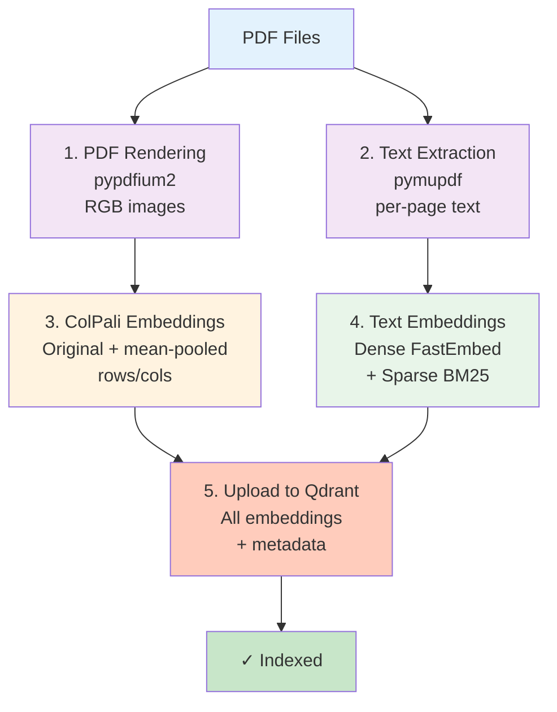
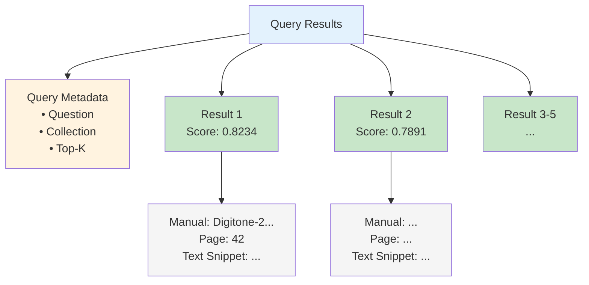
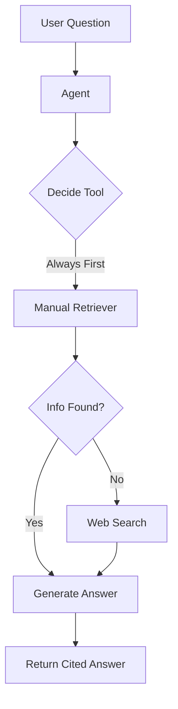
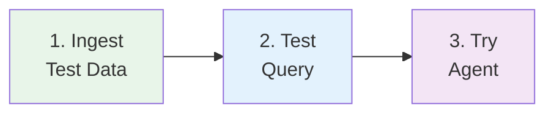

# Usage Guide

Complete guide to using Synth-RAG.

---

## Overview

Synth-RAG provides three main interfaces:

1. **Ingestion** (`manuals_ingest.py`) - Index PDF manuals into Qdrant
2. **Query** (`manuals_query.py`) - Hybrid search over manuals
3. **Agent** (`manuals_agent.py`) - Agentic RAG with web search fallback

---

## 1. Ingesting PDF Manuals

### Basic Ingestion

Ingest the test subset (recommended first):

```bash
uv run python -m synth_rag.manuals_ingest \
    --subset test \
    --collection midi_manuals \
    --device mps \
    --recreate-collection \
    --clear-tmp
```

### All Options

```bash
uv run python -m synth_rag.manuals_ingest \
    --subset {test,full} \           # Which PDF subset to ingest
    --collection NAME \               # Qdrant collection name
    --device {mps,cuda:0,cpu} \      # Compute device
    --batch-size N \                  # Batch size for ColPali (default: 4)
    --clear-tmp \                     # Clear tmp directories first
    --recreate-collection             # Delete & recreate collection
```

### What Happens During Ingestion



**Ingestion Steps:**

1. **PDF Rendering**: Each page is rendered to RGB image using `pypdfium2`
2. **Text Extraction**: Per-page text extracted with `pymupdf`
3. **ColPali Embeddings**: Original multivectors + mean-pooled rows/cols
4. **Text Embeddings**: Dense (FastEmbed) + sparse (BM25) vectors
5. **Upload**: All embeddings and metadata uploaded to Qdrant

### Performance Tuning

**Reduce Memory Usage**:
```bash
--batch-size 2
```

**Speed Up on GPU**:
```bash
--device cuda:0 --batch-size 8
```

**Clear Stale Data**:
```bash
--clear-tmp  # Clears documents/midi_synthesizers/tmp/
```

---

## 2. Querying Manuals

### Basic Query

```bash
uv run python -m synth_rag.manuals_query \
    --question "How do I set up MIDI channels?" \
    --collection midi_manuals \
    --device mps
```

### All Options

```bash
uv run python -m synth_rag.manuals_query \
    --question "Your question here" \     # Query (required)
    --collection NAME \                    # Collection name
    --top-k N \                           # Results to return (default: 5)
    --prefetch-limit N \                  # Prefetch for reranking (default: 50)
    --device {mps,cuda:0,cpu} \           # Device for ColPali
    --manual-filter NAME                  # Filter by manual name (optional)
```

### Example: Filter by Manual

```bash
uv run python -m synth_rag.manuals_query \
    --question "How does the reverb work?" \
    --manual-filter "Digitone" \
    --collection midi_manuals
```

### Output Format



**Example Output:**

```
=== QUERY RESULTS ===

Question: How do I set up MIDI channels?
Collection: midi_manuals
Top-K: 5

─────────────────────────────────────────

[Result 1/5] Score: 0.8234

Manual: Digitone-2-User-Manual_ENG_OS1.10D_251022
Page: 42

Text Snippet:
MIDI Settings

To configure MIDI channels for each track:
1. Press [FUNCTION] + [TRACK]
2. Select the track (1-8)
3. Set MIDI Channel in the settings menu

Each track can transmit on a different MIDI channel (1-16).

─────────────────────────────────────────

[Result 2/5] Score: 0.7891
...
```

### Query Logs

Queries are automatically logged to:
```
logs/manuals_queries/<timestamp>.json
```

Each log contains:
- Question
- Timestamp
- Collection name
- Top-K and prefetch settings
- All results with scores and metadata

---

## 3. Agentic RAG

### Basic Agent Usage

```bash
uv run python -m synth_rag.manuals_agent \
    --question "What are the differences between Digitakt and Digitone?" \
    --collection midi_manuals \
    --device mps
```

### All Options

```bash
uv run python -m synth_rag.manuals_agent \
    --question "Your question here" \     # Query (required)
    --collection NAME \                    # Collection name
    --model MODEL_NAME \                   # OpenAI model (default: gpt-4o-mini)
    --device {mps,cuda:0,cpu} \           # Device for ColPali
    --top-k N                             # Results per retrieval (default: 3)
```

### How the Agent Works

The agent follows this workflow:



### Agent Behavior

1. **Always queries manuals first** (no exceptions)
2. **Falls back to web search** only if manual search fails
3. **Provides citations** with manual names and page numbers
4. **Structures responses** with clear sections

### Example Output

```
## Information from Manuals

The Digitone II is an FM synthesizer with 8 tracks (Digitone-2-User-Manual, Page 12). 
Each track features 4 FM operators with multiple algorithms (Digitone-2-User-Manual, Page 45).

The Digitakt II is primarily a drum machine and sampler (Digitakt-2-User-Manual, Page 8).
It has 16 tracks for triggering samples (Digitakt-2-User-Manual, Page 10).

Key Differences:
- Sound Engine: FM synthesis vs Sample playback
- Track Count: 8 tracks (Digitone) vs 16 tracks (Digitakt)
- Use Case: Melodic/harmonic vs Rhythmic/percussive

## Additional Web Search Results

According to Elektronauts forum, many producers use both devices together...
```

---

## 4. Gradio Web UI

### Launch UI

```bash
uv run python -m synth_rag.manuals_ui
```

Opens a browser at `http://localhost:7860` with a chat interface.

### Features

- Chat-based Q&A
- Real-time streaming responses
- Automatic citation formatting
- Clear chat history button

---

## Common Workflows

### Workflow 1: First-Time Setup



```bash
# 1. Ingest test data
uv run python -m synth_rag.manuals_ingest \
    --subset test \
    --collection midi_manuals \
    --recreate-collection

# 2. Test query
uv run python -m synth_rag.manuals_query \
    --question "How many tracks does the Digitone II have?"

# 3. Try agent
uv run python -m synth_rag.manuals_agent \
    --question "Explain the Digitone II's FM synthesis engine"
```

### Workflow 2: Update Collection

```bash
# Clear old data and re-ingest
uv run python -m synth_rag.manuals_ingest \
    --subset full \
    --collection midi_manuals \
    --recreate-collection \
    --clear-tmp
```

### Workflow 3: Experiment with Settings

```bash
# Compare different top-k values
uv run python -m synth_rag.manuals_query \
    --question "How do I adjust the filter cutoff?" \
    --top-k 3

uv run python -m synth_rag.manuals_query \
    --question "How do I adjust the filter cutoff?" \
    --top-k 10
```

---

## Best Practices

### 1. Start Small
Always test with `--subset test` before ingesting the full collection.

### 2. Tune Batch Size
- **High-end GPU**: `--batch-size 8`
- **Apple Silicon**: `--batch-size 4` (default)
- **CPU/Low memory**: `--batch-size 1`

### 3. Use Appropriate Top-K
- **Specific questions**: `--top-k 3`
- **Broad questions**: `--top-k 10`
- **Exploration**: `--prefetch-limit 100`

### 4. Leverage Filters
Use `--manual-filter` when you know which manual to search:
```bash
--manual-filter "Digitone"
```

### 5. Monitor Logs
Check query logs for debugging:
```bash
ls -lh logs/manuals_queries/
```

---

## Next Steps

- [Architecture](architecture.md) - Understand the internals
- [API Reference](api/settings.md) - Explore the codebase
- [Troubleshooting](troubleshooting.md) - Fix common issues

