# Usage Guide

## Overview

Synth-RAG provides three main interfaces:

1. **Ingestion** (`manuals_ingest.py`) - Index PDF manuals into Qdrant
2. **Query** (`manuals_query.py`) - Hybrid search over manuals
3. **Agent** (`manuals_agent.py`) - Agentic RAG with web search fallback

---

## 1. Ingesting PDF Manuals

### Basic Ingestion

```bash
uv run python -m synth_rag.manuals_ingest \
    --subset test \
    --collection midi_manuals \
    --device cpu \
    --recreate-collection \
    --clear-tmp
```

```bash
uv run python -m synth_rag.manuals_ingest \
    --subset full \
    --collection midi_manuals_full \
    --device mps \
    --recreate-collection \
    --clear-tmp
```


### Options

```bash
uv run python -m synth_rag.manuals_ingest \
    --subset {test,full} \           # Which PDF subset to ingest
    --collection NAME \               # Qdrant collection name
    --device {mps,cuda:0,cpu} \      # Compute device
    --batch-size N \                  # Batch size for ColPali (default: 4)
    --clear-tmp \                     # Clear tmp directories first
    --recreate-collection             # Delete & recreate collection
```

### Ingestion Pipeline

```mermaid
graph TD
    Start[PDF Files] --> Stage1[1. PDF Rendering<br/>pypdfium2<br/>RGB images]
    Start --> Stage2[2. Text Extraction<br/>pymupdf<br/>per-page text]
    
    Stage1 --> Stage3[3. ColPali Embeddings<br/>Original + mean-pooled<br/>rows/cols]
    Stage2 --> Stage4[4. Text Embeddings<br/>Dense FastEmbed<br/>+ Sparse BM25]
    
    Stage3 --> Stage5[5. Upload to Qdrant<br/>All embeddings<br/>+ metadata]
    Stage4 --> Stage5
    
    Stage5 --> Complete[✓ Indexed]
    
    style Start fill:#e3f2fd
    style Stage1 fill:#f3e5f5
    style Stage2 fill:#f3e5f5
    style Stage3 fill:#fff3e0
    style Stage4 fill:#e8f5e9
    style Stage5 fill:#ffccbc
    style Complete fill:#c8e6c9
```



**Ingestion Steps:**

1. **PDF Rendering**: Each page is rendered to RGB image using `pypdfium2`
2. **Text Extraction**: Per-page text extracted with `pymupdf`
3. **ColPali Embeddings**: Original multivectors + mean-pooled rows/cols
4. **Text Embeddings**: Dense (FastEmbed) + sparse (BM25) vectors
5. **Upload**: All embeddings and metadata uploaded to Qdrant

---

## 2. Querying Manuals

### Basic Query

```bash
uv run python -m synth_rag.manuals_query \
    --question "How do I set up MIDI channels?" \
    --collection midi_manuals \
    --device mps
```

### Options

```bash
uv run python -m synth_rag.manuals_query \
    --question "Your question here" \     # Query (required)
    --collection NAME \                    # Collection name
    --top-k N \                           # Results to return (default: 5)
    --prefetch-limit N \                  # Prefetch for reranking (default: 50)
    --device {mps,cuda:0,cpu} \           # Device for ColPali
    --manual-filter NAME                  # Filter by manual name (optional)
```

### Example: Filter by Manual

```bash
uv run python -m synth_rag.manuals_query \
    --question "How does the reverb work?" \
    --manual-filter "Digitone" \
    --collection midi_manuals
```

### Query Logs

Queries are automatically logged to `logs/manuals_queries/<timestamp>.json`.

---

## 3. Agentic RAG

### Basic Agent Usage

```bash
uv run python -m synth_rag.manuals_agent \
    --question "What are the differences between Digitakt and Digitone?" \
    --collection midi_manuals \
    --device mps
```

### Options

```bash
uv run python -m synth_rag.manuals_agent \
    --question "Your question here" \     # Query (required)
    --collection NAME \                    # Collection name
    --model MODEL_NAME \                   # OpenAI model (default: gpt-4o-mini)
    --device {mps,cuda:0,cpu} \           # Device for ColPali
    --top-k N                             # Results per retrieval (default: 3)
```

### How the Agent Works

1. **Always queries manuals first** (no exceptions)
2. **Falls back to web search** only if manual search fails
3. **Provides citations** with manual names and page numbers
4. **Structures responses** with clear sections

---

## 4. Gradio Web UI

### Launch UI

```bash
uv run python -m synth_rag.manuals_ui
```

Opens a browser at `http://localhost:7860` with a chat interface.

---

## Common Workflows

### Workflow 1: First-Time Setup


```bash
# 1. Ingest test data
uv run python -m synth_rag.manuals_ingest \
    --subset test \
    --collection midi_manuals \
    --recreate-collection

# 2. Test query
uv run python -m synth_rag.manuals_query \
    --question "How many tracks does the Digitone II have?"

# 3. Try agent
uv run python -m synth_rag.manuals_agent \
    --question "Explain the Digitone II's FM synthesis engine"
```

### Workflow 2: Update Collection

```bash
# Clear old data and re-ingest
uv run python -m synth_rag.manuals_ingest \
    --subset full \
    --collection midi_manuals \
    --recreate-collection \
    --clear-tmp
```

---

## Next Steps

- [Architecture](architecture.md) - Understand the internals
- [API Reference](api/settings.md) - Explore the codebase
